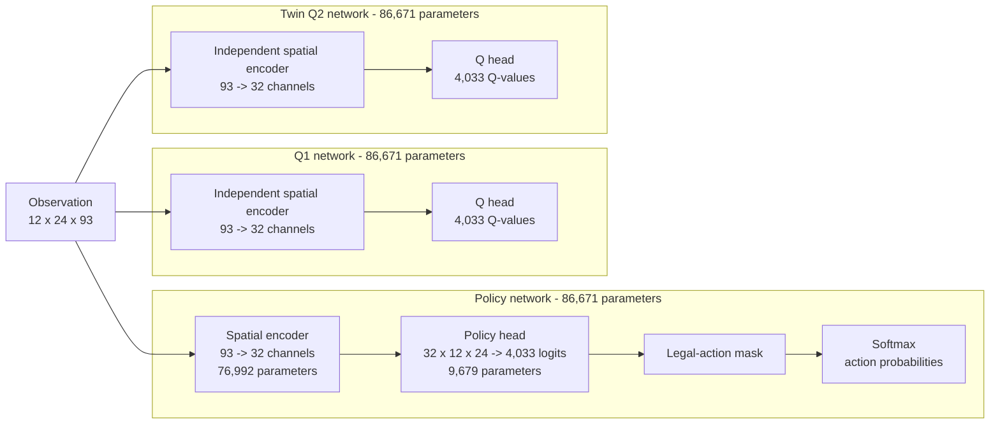
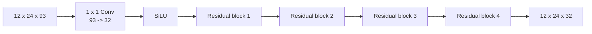
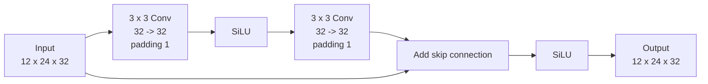

# Cellularena SAC Network Architecture

This document describes the discrete SAC network implemented in
[`modules.py`](modules.py). Dimensions below use the current configuration with
one observation-history step.

## Overview



The policy, Q1, and Q2 networks do not share parameters. Together they contain
260,013 trainable parameters. RLlib manages the target-Q computation and target
synchronization used by SAC; it reuses the critic topology rather than a
separate architecture declared in this module.

## Spatial Encoder

Each of the three networks has its own encoder:



The `1 x 1` stem embeds each cell's 93 input features into 32 learned latent
features without mixing neighboring cells. There is no pooling, stride, or
spatial resizing, so the grid remains `12 x 24` throughout.

Each residual block is:



Four blocks contain eight `3 x 3` convolutions. Each expands the receptive
field by two cells, giving the final embedding a theoretical receptive field
of:

$$1 + 8 \times 2 = 17$$

Therefore, each output location can use information from a `17 x 17` region of
the input grid. Zero padding clips the effective context at board boundaries.

### Encoder Parameters

| Component | Shape | Parameters |
|---|---:|---:|
| Stem convolution | `93 -> 32`, `1 x 1` | 3,008 |
| One residual block | two `32 -> 32`, `3 x 3` convolutions | 18,496 |
| Four residual blocks | 8 convolutions | 73,984 |
| **One encoder** | | **76,992** |

With `obs_history_steps > 1`, the stem input becomes
`93 * obs_history_steps`; the remaining encoder dimensions are unchanged.

## Policy And Q Heads

Policy and critic heads have the same output shape but different meaning and
initialization scale. Each head has two branches:

1. A `1 x 1` convolution maps the 32 latent channels to 14 grow-action
   channels at every grid location. Flattening produces
   `14 * 12 * 24 = 4,032` values.
2. A linear layer maps the full `32 * 12 * 24 = 9,216` embedding to one global
   `WAIT` value.

Concatenating both branches produces 4,033 outputs:

```text
[14 grow channels x 12 rows x 24 columns] + [WAIT]
                 4,032                  +   1
```

The grow channels encode `ROOT`, `BASIC`, and the four directions for each of
`TENTACLE`, `HARVESTER`, and `SPORER`.

| Head component | Parameters |
|---|---:|
| Grow `1 x 1` convolution | 462 |
| Global `WAIT` linear layer | 9,217 |
| **One head** | **9,679** |

For the policy, these outputs are logits. Illegal actions are replaced with the
minimum representable value before softmax in inference and training, making
their probability zero. For Q1 and Q2, the outputs are per-action Q-values; the
masked policy probabilities determine which legal actions contribute to the
discrete SAC objectives.

## Initialization

All convolution and linear biases start at zero. Weights use orthogonal
initialization with these gains:

| Layer | Gain |
|---|---:|
| Stem `1 x 1` convolution | $\sqrt{2}$ |
| First convolution in each residual block | $\sqrt{2}$ |
| Second convolution in each residual block | initialized to exactly zero |
| Policy head | 0.01 |
| Q1 and Q2 heads | 1.0 |

Zero-initializing each residual branch's final convolution makes every block
start as a skip path followed by `SiLU`. Unlike ReLU, SiLU has a nonzero
derivative at zero, allowing every zero-initialized residual output channel to
receive gradients from its first optimizer update.

The architecture contains no normalization, dropout, pooling, recurrence, or
attention layers.
